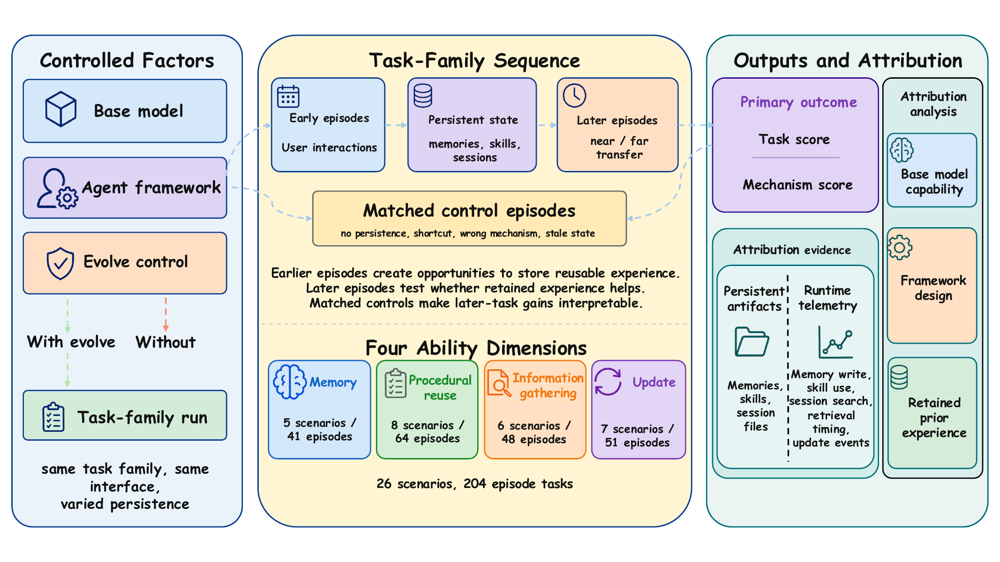

<div align="center">

# PAST-Bench

### Benchmarking the Foundations of Recursive Self-Improvement in Personal Agents

<p>
  <a href="https://arxiv.org/abs/2608.04003">
    
  </a>
  
  <a href="LICENSE"></a>
</p>

</div>

## 🌟 Overview

> **Does a persistent agent actually improve by learning from its past experience?**

**PAST-Bench** is a benchmark for evaluating and attributing cross-session improvement in persistent agents. Rather than scoring isolated tasks, it evaluates ordered task-family sequences in which earlier episodes create opportunities to retain experience and later fresh-session episodes test whether that experience improves future behavior.

## Key Contributions

- **PAST-Bench: a controlled benchmark for attributable cross-session improvement.** PAST-Bench evaluates agents through longitudinal fresh-session task sequences and combines matched persistence-on/off controls with artifact- and trace-level evidence. It contains **26 task families and 204 episodes** across Memory, Procedural Reuse, Information Gathering, and Update, enabling both capability-level evaluation and mechanism-level attribution.

- **Hermes+: a diagnosis-driven framework for experience-based improvement.** Guided by failures identified through PAST-Bench, Hermes+ augments the agent loop with five targeted mechanisms—**Plan, Render, Route, Gate, and Close**—to improve how experience is consulted, represented, routed, retrieved, and updated across sessions.


<p align="center">
  
</p>


## 🚀 Quick Start

### Requirements

- Python 3.11+
- [uv](https://docs.astral.sh/uv/)
- Docker with a running daemon
- network access for packages, Docker images, and model APIs
- an API key for each model profile you use

### Install

```bash
python3.11 -m pip install --user uv
export PATH="$(python3.11 -m site --user-base)/bin:$PATH"
export UV_HTTP_TIMEOUT=300

uv venv --python 3.11 --seed
source .venv/bin/activate

uv pip install -e ".[mock,sandbox,dev]"
uv pip install -e agents/hermes-agent
uv pip install -e agents/hermes-plus
```

Install the comparison agents when you need the fixed-model agent experiment:

```bash
uv pip install -e agents/nanobot
uv pip install -e agents/zeroclaw/python
uv pip install -r agents/agent-zero/requirements-docker.txt --prefer-binary
```

Build the sandbox image:

```bash
past-bench build-image --kind sandbox
```

If Docker Hub is unavailable, build the same image through a registry mirror:

```bash
docker build --build-arg REGISTRY=docker.m.daocloud.io \
  -t past-bench-agent:latest \
  -f Dockerfile.agent .
```

## 🔑 Model Profiles

Model profiles live in `configs/agents.yaml`.

| Model | Profile | API key environment variable |
| --- | --- | --- |
| MiniMax-M2.7 | `minimax` | `MINIMAX_API_KEY` |
| GLM-5.1 | `glm` | `ZAI_API_KEY` |
| Kimi K2.6 | `kimi` | `KIMI_CODE_API_KEY` |
| DeepSeek-V4-Pro | `deepseek` | `DEEPSEEK_API_KEY` |
| GPT-5.4 | `openai_gpt54` | `OPENAI_API_KEY` |

Set only the keys you need:

```bash
export MINIMAX_API_KEY=...
```

The tracked `config.yaml` selects MiniMax-M2.7 as the default judge and leaves `api_key` empty. Keep credentials in environment variables rather than writing them into tracked files.

Check the installation:

```bash
past-bench list-agents
past-bench doctor --agent hermes-plus --agent-profile minimax
past-bench validate-agent --agent hermes-plus --agent-profile minimax --runtime local
python -m pytest
```

## 🧪 Smoke Test

Run one task family with Hermes+ and MiniMax:

```bash
HERMES_PLUS_MECHANISMS=all past-bench evolve \
  --family memory_ability/SM01_preference_adoption \
  --agent hermes-plus \
  --agent-profile minimax \
  --runtime local \
  --sandbox \
  --sandbox-tools \
  --compare-no-persistence \
  --judge-model MiniMax-M2.7 \
  --trace-dir traces/smoke/hermes_plus_minimax_sm01
```

The run writes:

```text
traces/smoke/hermes_plus_minimax_sm01/sequence_results.json
traces/smoke/hermes_plus_minimax_sm01/sequence_summary.json
traces/smoke/hermes_plus_minimax_sm01/sequence_comparison.json
```

## 🧩 Benchmark Structure

The active suite is `self-evolve-tasks-v2/`.

| Directory | Ability | Families | Episodes |
| --- | --- | ---: | ---: |
| `memory_ability/` | Retain stable preferences, constraints, and prior cases | 5 | 41 |
| `procedural_ability/` | Reuse procedures and skills | 8 | 64 |
| `proactive_information_gathering/` | Look up prior context before acting | 6 | 48 |
| `update_ability/` | Replace stale facts, rules, and procedures | 7 | 51 |

Each family contains a `family.yaml` file and one directory per episode. PAST-Bench builds the sequence manifest from the family definition at run time. Reference manifests are also available in `configs/self_evolve_v2/`.

<details>
<summary>Show all 26 task families</summary>

```bash
FAMILIES=(
  memory_ability/EP01_prior_case_recall
  memory_ability/EP02_exception_list_recall
  memory_ability/SM01_preference_adoption
  memory_ability/SM02_constraint_retention
  memory_ability/SM05_weak_trigger_preference_adoption
  proactive_information_gathering/PG01_release_decision_followup
  proactive_information_gathering/PG02_ops_exception_desk
  proactive_information_gathering/PG03_oncall_handoff_lookup
  proactive_information_gathering/PG04_temporary_waiver_audit
  proactive_information_gathering/PG05_change_freeze_followup
  proactive_information_gathering/PG06_kappa_integration_review
  procedural_ability/PC01_sop_bootstrap_01
  procedural_ability/PC01_sop_bootstrap_02
  procedural_ability/PC01_sop_bootstrap_03
  procedural_ability/PC01_sop_bootstrap_04
  procedural_ability/PC01_sop_bootstrap_05
  procedural_ability/PC01_sop_bootstrap_06
  procedural_ability/PC03_latent_rule_induction_01
  procedural_ability/PC04_failure_to_rule_01
  update_ability/EP03_recall_then_modify
  update_ability/PC02_sop_patch_01
  update_ability/PC02_sop_patch_02
  update_ability/SM03_fact_correction
  update_ability/SM04_rule_migration
  update_ability/SM06_temporary_exception_pollution
  update_ability/SM07_scoped_rule_migration
)
```

</details>

## 🧪 Main Experiments

All experiments use the same `FAMILIES` list above.

### 1. Hermes model comparison

Keep the Hermes agent fixed and vary the model:

```bash
MODEL_PROFILES=(minimax glm kimi deepseek openai_gpt54)
RUN_ID=run1

for MODEL_PROFILE in "${MODEL_PROFILES[@]}"; do
  for FAMILY in "${FAMILIES[@]}"; do
    SAFE_FAMILY="${FAMILY//\//_}"
    past-bench evolve \
      --family "$FAMILY" \
      --agent hermes \
      --agent-profile "$MODEL_PROFILE" \
      --runtime local \
      --sandbox \
      --sandbox-tools \
      --compare-no-persistence \
      --judge-model MiniMax-M2.7 \
      --trace-dir "traces/main/hermes_model_comparison/${MODEL_PROFILE}/${RUN_ID}/${SAFE_FAMILY}"
  done
done
```

### 2. Fixed-model agent comparison

Keep MiniMax-M2.7 fixed and vary the agent:

```bash
AGENTS=(hermes hermes-plus nanobot zeroclaw)
MODEL_PROFILE=minimax
RUN_ID=run1

for AGENT in "${AGENTS[@]}"; do
  for FAMILY in "${FAMILIES[@]}"; do
    SAFE_FAMILY="${FAMILY//\//_}"
    HERMES_PLUS_MECHANISMS=all past-bench evolve \
      --family "$FAMILY" \
      --agent "$AGENT" \
      --agent-profile "$MODEL_PROFILE" \
      --runtime local \
      --sandbox \
      --sandbox-tools \
      --compare-no-persistence \
      --judge-model MiniMax-M2.7 \
      --trace-dir "traces/main/agent_comparison/${AGENT}_${MODEL_PROFILE}/${RUN_ID}/${SAFE_FAMILY}"
  done
done
```

Agent Zero uses its own execution model and runs without the paired persistence backend:

```bash
MODEL_PROFILE=minimax
RUN_ID=run1

for FAMILY in "${FAMILIES[@]}"; do
  SAFE_FAMILY="${FAMILY//\//_}"
  past-bench evolve \
    --family "$FAMILY" \
    --agent agent_zero \
    --agent-profile "$MODEL_PROFILE" \
    --runtime local \
    --trace-dir "traces/main/agent_comparison/agent_zero_${MODEL_PROFILE}/${RUN_ID}/${SAFE_FAMILY}"
done
```

### 3. Hermes+ model comparison

Keep Hermes+ fixed with all five mechanisms enabled and vary the model:

```bash
MODEL_PROFILES=(minimax glm kimi deepseek openai_gpt54)
RUN_ID=run1

for MODEL_PROFILE in "${MODEL_PROFILES[@]}"; do
  for FAMILY in "${FAMILIES[@]}"; do
    SAFE_FAMILY="${FAMILY//\//_}"
    HERMES_PLUS_MECHANISMS=all past-bench evolve \
      --family "$FAMILY" \
      --agent hermes-plus \
      --agent-profile "$MODEL_PROFILE" \
      --runtime local \
      --sandbox \
      --sandbox-tools \
      --compare-no-persistence \
      --judge-model MiniMax-M2.7 \
      --trace-dir "traces/main/hermes_plus_model_comparison/${MODEL_PROFILE}/${RUN_ID}/${SAFE_FAMILY}"
  done
done
```

### 4. Hermes+ mechanism ablation

```bash
scripts/run_hermes_plus_mechanisms_full.sh \
  --trace-root traces/main/mechanism_ablation/minimax_m27 \
  --agent-profile minimax \
  --runtime local \
  --judge-model MiniMax-M2.7
```

Run one mechanism or a small subset:

```bash
scripts/run_hermes_plus_mechanisms_full.sh \
  --mechanism memory \
  --families memory_ability/SM02_constraint_retention,update_ability/EP03_recall_then_modify \
  --trace-root traces/smoke/mechanism_memory \
  --agent-profile minimax \
  --runtime local \
  --judge-model MiniMax-M2.7
```

## 📊 Outputs

Each paired family run writes:

- `sequence_results.json`: per-episode results;
- `sequence_summary.json`: sequence-level summary;
- `sequence_comparison.json`: with-evolution, without-evolution, and delta scores.

Generated traces, logs, caches, virtual environments, and API keys should not be committed.

## 📁 Repository Structure

```text
PAST-Bench/
├── src/past_bench/           # benchmark runner, graders, metrics, and adapters
├── self-evolve-tasks-v2/     # 26 task families
├── configs/                  # model profiles and reference manifests
├── mock_services/            # local services used by benchmark tasks
├── agents/                   # supported third-party agent frameworks
├── scripts/                  # experiment and reporting scripts
└── tests/                    # test suite
```

## 🙏 Third-Party Components

PAST-Bench includes adapters or local copies of:

- [Agent Zero](https://github.com/agent0ai/agent-zero)
- [Hermes Agent](https://github.com/NousResearch/hermes-agent), including the local Hermes+ variant
- [nanobot](https://github.com/HKUDS/nanobot)
- [ZeroClaw](https://github.com/zeroclaw-labs/zeroclaw)

These components keep their original license files under `agents/`.

## 📖 Citation

```
@article{xue2026pastbench,
  title={PAST-Bench: Benchmarking the Foundations of Recursive Self-Improvement in Personal Agents},
  author={Xue, Shuhan and Ding, Zixin and Shen, Yichen and Wang, Yinjie and Yin, Zhenfei and Wu, Yingcheng and Chen, Yuxin and Wang, Mengdi and Yang, Ling},
  journal={arXiv preprint arXiv:2608.04003},
  year={2026}
}
```

## 📄 License

PAST-Bench's original code is released under the [Apache License 2.0](LICENSE). Third-party components retain their upstream licenses.
